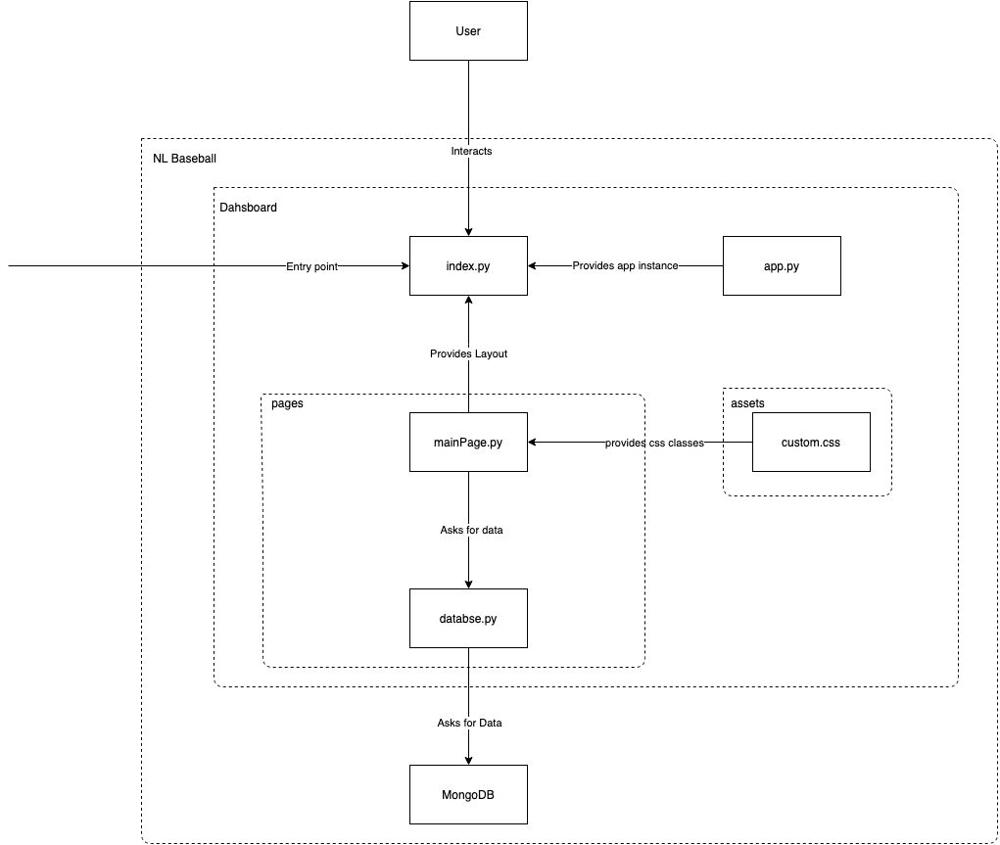

# Welcome to the Dashboard Docs

The goal of this documentation is to help future developers of this project to understand what is going on in the dashboard. We are going to look at the most important files and concepts without going to deep into the functionality of the framework. 

## General information

The dashboard is made with Plotly-Dash. To really understand what is going on, you should take a look at the official Documentation of Dash https://dash.plotly.com/

The main idea behind the dashboard was to present all data which is collect by the dataScraper, while building some similar data visualization as the official mlb and milb site. The Dashboard is mostly table based as this is the easiest way to present a lot of data. More graphs could be implemented and might be interesting for further developments.

## Dashboard Layout

    Dashboard/                         
        assets/
            custom.css
            favicon.ico
            SDV_bat_header_copy.jpg
        pages/
            __init__.py
            database.py                 # abstraction for database quiring and data formatting
            mainPage.py                 # provides almost all of visible elements
            squads.py
        app.py
        Dockerfile
        index.py                        # entry point and routing
        requirements.txt

## Class/Data flow Diagram

The purpose of the following diagram is to give an overview of the relationships between the different files in the dashboard.

## index.py and app.py

In app.py a dash app instance is instantiated. A few parameters get passed to the app instance. 

In index.py the app instance is imported, and the root layout of the app is provided. This is also the place where the header and routes to different layouts can be provided. Since the dashboard follows the structure of a multipage dashboard, the index.py file is the entry point to the dashboard. Read more about that [here](https://dash.plotly.com/urls)

## mainPage.py, database.py & custom.css

mainPage.py provides the layout of the main page. This includes almost all elements visible on the dashboard. It also includes a bunch of callbacks which provide interactive functionality like buttons and dropdowns. Read more about callbacks [here](https://dash.plotly.com/basic-callbacks)

database.py provides a level of abstraction between the layout and the mongoDB. It was created to outsource database quiring and data formatting to one file in reusable functions. Almost all functions get called from the mainPage.py file, especially in the functions of the callbacks.

custom.css is the place where custom css classes are defined. The classes can be referenced in any other file, most references are in mainPage.py (“className” argument in the layout variable”). Read more about custom css in dash [here](https://dash.plotly.com/external-resources)

In the “pages” folder you can also find the squads.py file which was meant to be another page in the layout for squad functionality. That feature didn’t get implemented because the time wasn’t enough. It was left in as well as the reference to it in the index.py file in case someone wants to implement that feature. More about that in the [Backlog](backlog.md)

To learn more about the dashboard, skim through the files named on this page and read the comments.
