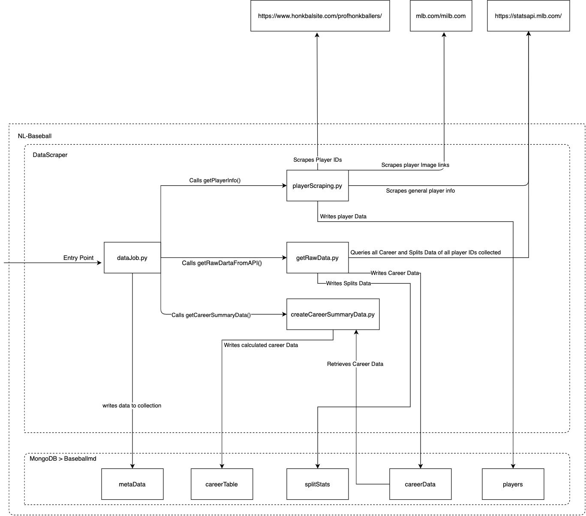
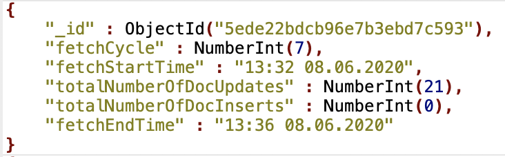
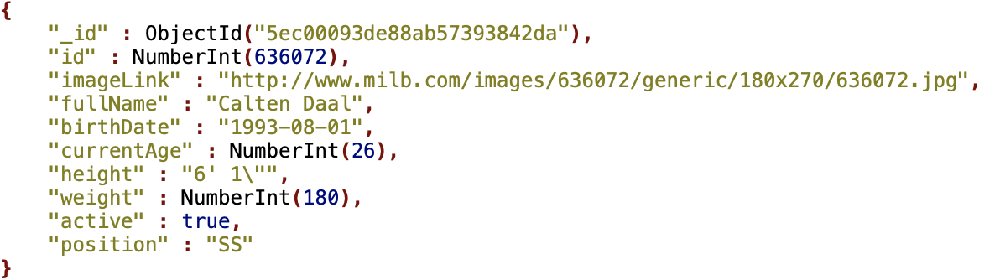
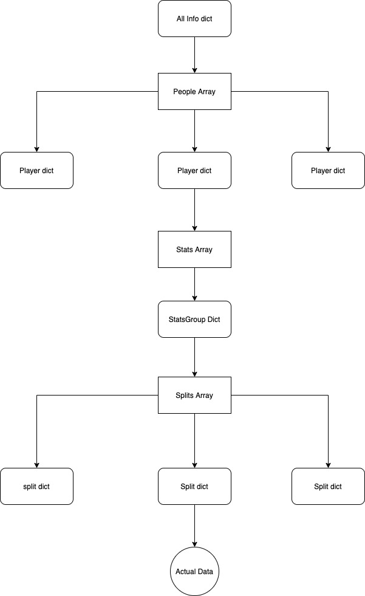
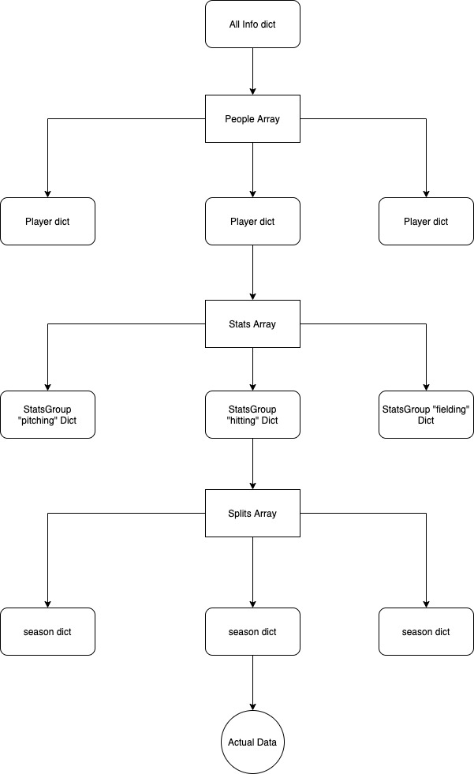

# Welcome to the DataScraper Docs

The goal of this documentations is to give a high-level overview of the inner workings of the Data Scraper. We are going from the bigger picture more and more into detail. Additionally, you can find some comments throughout the source code which should help you understand what’s going on. 

## General information:

The DataScraper takes care of collecting all needed data for the dashboard and storing it in our mongoDB. It is designed to run every night and detect changes in documents or insert new ones. Data sources are: 

-	https://www.honkbalsite.com/profhonkballers/
-	The links on the above website are followed to collect links to the player image on the website
-	The main data source is the official, free to use API: https://statsapi.mlb.com/
-	The above API is accessed through the API Wrapper “MLB-StatsAPI” made by “toddrob99”. Learn more about it [here](https://github.com/toddrob99/MLB-StatsAPI)

## Data Scraper Layout

        app/                                                              
            package/				
                __init__.py						
                createCareerSummaryData.py	# creates data for career table in dashboard
                getRawData.py			    # get all the raw data of all players
                playerScraping.py			# gets general plaer information
            __init__.py
            config.py                       # central database connection provider
        datajob.py                          # entry point of DataScraper
        Dockerfile
        requirements.txt

## Class/Data flow Diagram

The purpose of the following diagram is to give an overview of the relationships between the different files, data sources and database collections:

Although the diagram is very busy, it is not as complicated as it seems. We are going break down what exactly happens in all those .py files in the next paragraphs.

## dataJob.py

The dataJob.py file is the entry point to the DataScraper, meaning, that it includes the function which start the process of scraping and aggregating all data. Therefore, it takes care of the following things:

-	Imports the “schedule” package to schedule the data collection process to run every night at 3 am.
-	Calls the main functions in the files “playerScraping.py”, “getRawData.py” and “createCareerSummaryData.py” files in the correct order.
-	Collects meta data about the “fetchCycle” like how many documents were updated or inserted in the database. Meta data also stores the time and data when the fetch cycle gets executed. A document containing the meta Data of the fetch cycle gets stored in the database and looks like this:
	

## playerScraping.py

The playerScraping file contains the first real collection process of player data. That process is defined in the single function called “getPlayerInfo()”. It works like this: 

1.	It reaches out to [honkbalsite](https://www.honkbalsite.com/profhonkballers/) via beautiful soup and collects all links that go to a mlb or milb website.  
2.	In those collected links, the ID of the player can be found, which is used by the mlb statsapi to link all data to that player.
3.	In the next step, each link to the website is followed in order to scrape the link to the players image from that website. These links are later used to display a picture of the player on the dashboard. 
4.	In the next step, the “person” endpoint of the mlb statsapi is queried for general data about the player. That data contains information like height, weight and age of the player. 
5.	In the last step, the mongoDB is queried for a similar document as the one which was just aggregated for that player. If a document is found, it is compared against the aggregated one. If they are identical, the function moves on to the next player. Else, the old document is deleted and the new one is stored. If there was no similar document in the first place, the document gets inserted in the database.

A Resulting document in the mongoDB looks like this:

## getRawData.py

“getRawData.py” contains three functions. 

-	The major one is the “getRawDataFromAPI()” which takes care of quiring all the data from the API. 
-	The other two functions get called from within “getRawDataFromAPI()”  and only take care of sorting through the raw data. One of these functions only takes care of Career Data and the other one of Splits Data.
-	The result of the process in the file is, that two collection in MonogDB are created and filled with data and that is “careerStats” and “splitStats”.
-	Also, these functions have updating mechanisms in place which take care of detecting whether a document is completely new, updated or already known to the database. 
-	For more information on the process look through the code and pay attention to the comments there.

Here is some interesting stuff to look at when you consider changing or building anything on top of those functions.

-	This is how a request link to the API can look like: [here](https://statsapi.mlb.com/api/v1/people?personIds=642720&hydrate=stats(type=%5BstatSplits%5D,sitCodes=%5Bh,a,d,n,g,t,1,2,3,4,5,6,7,8,9,10,11,12,preas,posas,vr,vl,r0,r1,r2,r3,r12,r13,r23,r123,risp,o0,o1,o2,i01,i02,i03,i04,i05,i06,i07,i08,i09,ix,b2,b3,b4,b4,b5,b6,lo,lc,ac,bc%5D,season=2019,sportId=12))
-	If you want to learn more about that I highly recommend to read the docs of the [API Wrapper](https://github.com/toddrob99/MLB-StatsAPI/wiki) and in this sub [reddit](https://www.reddit.com/r/mlbdata/)
-	This is how the data is nested in the response objects from the API:

I made those diagrams for myself during development to understand what was going on: 

Career Data: 

Splits Data:

## createCareerSummaryData.py

There is only one function in this file, which is really long. The sole purpose of that function is aggregate data and here is why:

-	We wanted to have a table on the dashboard, that allows browsing the stats of all players briefly, to get an overview.
-	We thought that the best data we could choose for that is the career summary data of each player.
-	For players who have played in the MLB we got documents from the API containing there career summary stats, for MiLB only player we had to aggregate that data.
-	The function is collecting the correct document for the MLB players and creating the right documents for the MiLB players. 
-	All that data is stored in a separate collection called “careerTable” 
-	The function has also a updating mechanism in place. 
-	This function runs at the end of the data collection process and takes the its input data form the database instead of the MLB API. 
