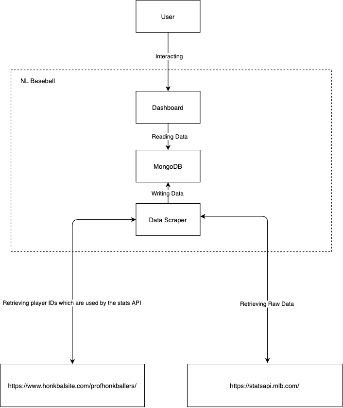

# Welcome to NL Baseball Docs

The goal of this documentation is to provide an overview on how the application works and what design choices were made. It should also help you installing or deploying the application. 

## Structure of the documentation

* [Index](index.md) - provides an overview of application and documentation
* [Installation](installation.md) – provides installations guides
* [Data Scraper](datascraper.md) – provides information on how the data scraper works
* [Dashboard](dashboard.md) - provides information on how the dashboard works
* [Backlog](backlog.md) - contains descriptions of remaining features.
* [About](about.md) - General Info about the project and the process of creating it

## Project layout level 1

    Dashboard/        # folder for all dashboard files
        ...
    databaseDump/     # folder for database dump files
        ...
    DataScraper/      # folder for all datascraper files
        ...
    docs/             # folder for all docs files
        ...
    .gitignore
    docker-compose.yml
    LICENSE
    mkdocs.yml
    README.md

## Application Architecture
This is a high level model of the application architecture

