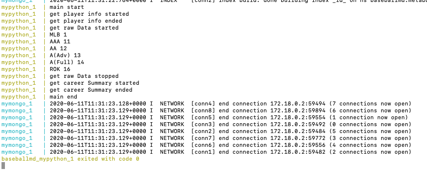
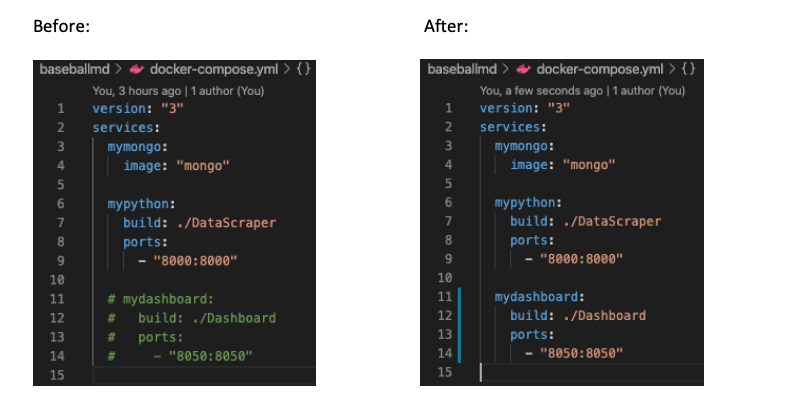
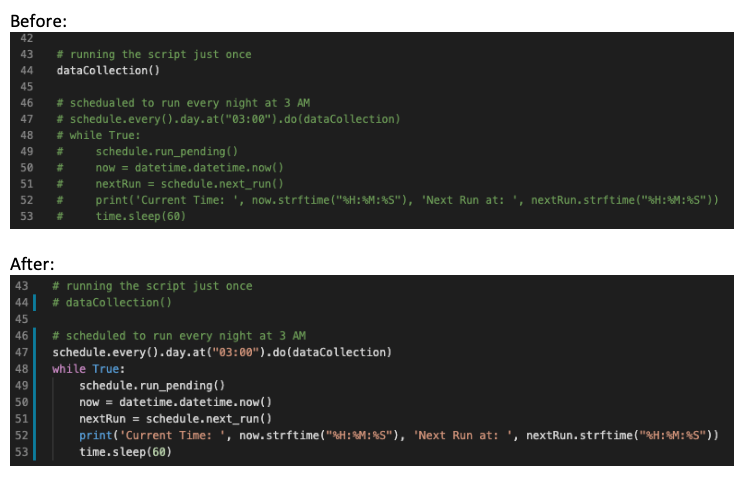
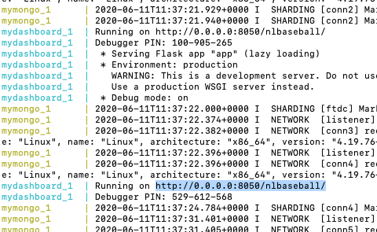
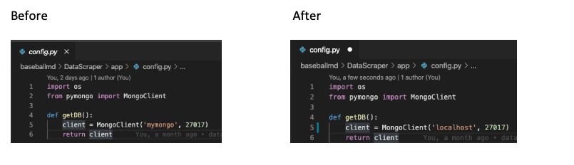
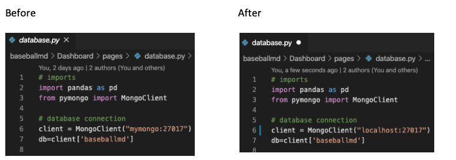
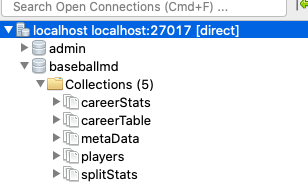
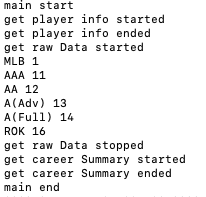
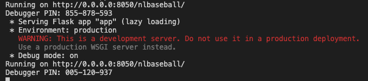
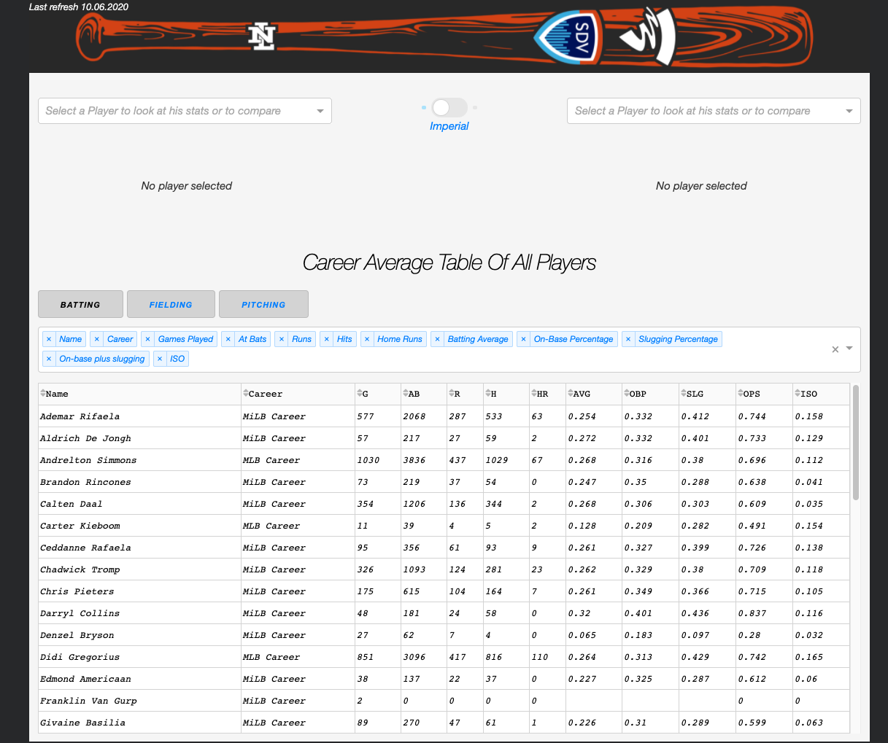

# Installation guides

There are two ways to install NL-Baseball on your machine or to deploy it on a sever.

1. Using Docker: Recommended for deploying and experienced developers
2. Using Pip: Recommended for exploring the project and unexperienced developers
3. If you are a student and just want to make the dashboard run quickly follow the pip guide and use a studio3t as a mongo Gui to import the dump files directly to mongo.

## Using Docker
-	The steps in this guide describe the process of installing NL-Baseball using docker.
-	The steps are only tested on a Mac and are guaranteed to work when followed closely and with the given configuration. 
-	After following this guide, you should have a working project without any security mechanisms in place. Meaning, the database is unprotected and the docker-compose only contains the bare minimum of parameters which might be needed for deploying the project.
-   Keep in mind: The steps in this guid are designed by a docker newbie. There probably is a better way to do this.

### Requirements
-	A working docker [installation](https://docs.docker.com/get-docker/)
-	A working docker-compose installation

### Step 1
-	Clone or download the [repository](https://gitlab.fdmci.hva.nl/ehringh/baseballmd)
-	Open a terminal in the project folder (baseballmd)
-	Run: `docker-compose up --build`

Now the monogdb container gets build and the data scraper script is executed.
When you see this ouput in the terminal, you know the data scraping has finished:

### Step 2
Now the database contains all needed data. We need to make some modifications in the code in order to make the dashboard, database and datas craper run in sync.

Follow these steps closely:

-	Exit the process in the terminal by pressing `control + c`
-	Open "docker-compose.yml" file and remove the comments like shown in the picture:

This will make the dashboard start up the next time you will run docker compose

-	Now navigate to the "DataScraper" directory and open "dataJob.py"
-	Edit the file exactly as shown in the picture below:

This makes the data scraper run only at night and keep the container up.

### Step 3
-	Make sure all files you have edited are saved
-	Run: `docker-compose up --build` again

The dashboard container should start up now as well and you should see this output in the terminal:

When you see it you can copy http://0.0.0.0:8050/nlbaseball/ to your web browser and you should see the dashboard.

### Step 4
If you want/need to modify anything look here:

For database connections

-   DataScraper > app > config.py 
-	Dashboard > pages > database.py

For port and url modification:

-   Dashboard > app.py
-	Dashboard > index.py
-	Dashboard > Dockerfile
-	docker-compose.yml

## Using Pip

-	Using pip is recommended for exploring this project and people with less programming experience.

### Requirements

-	[Python 3](https://www.python.org/) or higher
-	[MongoDB](https://www.mongodb.com/) mongod needs to be running in the background after the installation
-	Pip package manager: Comes with the python installation (you can check if it is installed by typing “pip” in the terminal
-	Optional but recommended: [Studio3T](https://studio3t.com/) or some other GUI for MongoDB

### Step 1

First Download the project and all its files

-	Clone or download the [repository](https://gitlab.fdmci.hva.nl/ehringh/baseballmd)

### Step 2

Since the major version of this project is set up to use docker, we need to make some small adjustments in the code regarding the database host. It is programmed to use a docker container as the database host, but we must change it to use the local installation of mongoDB.

Therefore, edit in the following files 'mymongo' to 'localhost' like described in the images:

-	In baseballmd > DataScraper > app > config.py:

-	In baseballmd > Dashboard > pages > database.py:

### Step 3

Now that the database host is correct, we need to put some data in the database, otherwise we won’t see anything in the dashboard. There are two ways to that:

-   Importing the database dump files (easy when Mongo GUI installed)
-	Running the Data Scraper script (Recommended if you care about the most recent data)

##### Way #1: Importing the database dump files:

-	Follow [this](https://studio3t.com/knowledge-base/articles/mongodb-import-json-csv-bson/) tutorial for Studio3T or search for your own way.
-	Use the Files provided in the databaseDump folder of this project.
-	You should end up with a database called “baseballmd” containing the following collection structure:

##### Way #2 Running the Data Scraper script

In this section we are going to install some dependencys (Python packages that are needed to execute the script). Is recommended to use a virtual environment to manage those dependency’s but it’s not necessary for it to work. If you would like to use it or read more about it got [here](https://packaging.python.org/guides/installing-using-pip-and-virtual-environments/)

-	Navigate in your terminal into the “DataScraper” directory
-	Run this command to install all packages: ‘pip install -r requirements.txt ‘
-	When the above command has finished, run ´python dataJob.py´ this will start the data collection process. You know that it is finished running when you see the output “main end” in the terminal. The entire terminal output will look something like this:

-	The collection structure in your database should look like this:

### Step 4

In this step we are going run the dashboard. We need to install some dependency’s using pip. It is recommended to use virtual environments to manage the dependency’s, but it also works without. If you would like to learn more about it go [here](https://packaging.python.org/guides/installing-using-pip-and-virtual-environments/)

-	Navigate in your terminal into the “Dashboard” directory
-	Run this command to install all packages: ‘pip install -r requirements.txt ‘
-	When the above command has finished, run ´python index.py´, this will start the dashboard you will get a printout in the Terminal like this:

-	Copy the displayed link (http://0.0.0.0:8050/nlbaseball/) to your web browser and you should see the dashboard:

